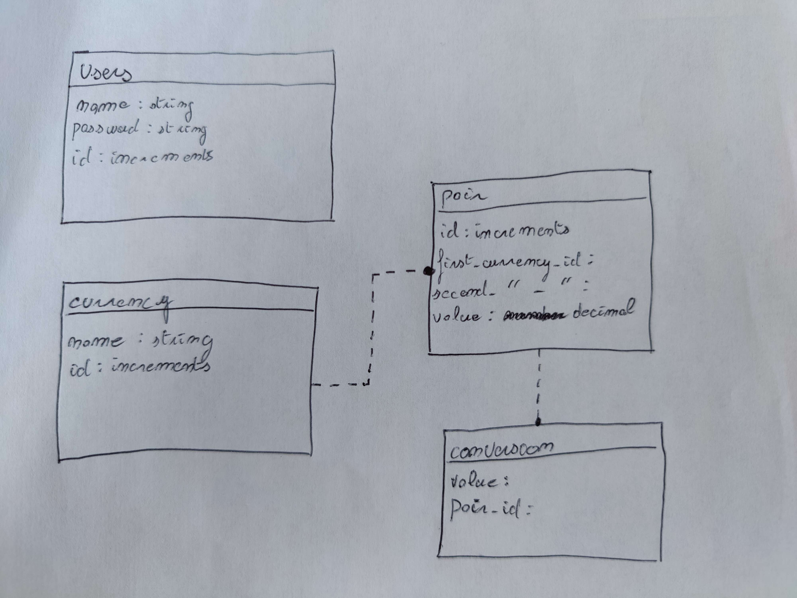

Rappel du sujet :

Vous venez d’être recruté comme développeur par Philippe - directeur d’une toute nouvelle
startup nommée MoneyValue afin de développer une plateforme de conversion monétaire.
MoneyValue travaille dans le domaine de la finance.
L’objectif de ce service public et gratuit est d’acquérir des données sur les conversions les plus
demandées.
L’objectif est de développer une API REST utilisable par des développeurs externes et qui
permet de convertir des devises en d’autres devises.
Vous devez également développer l’administration de l’API qui permet de gérer les devises
mises à disposition.

Mise en place du projet :

- npm install
- php artisan migrate
- php artisan db:seed --class=UserSeeder
- php artisan db:seed --class=CurrenciesSeeder
- npm run dev
- php artisan serv

Diagramme SQL : 



API :

# Lire le statut (ne fonctionne pas en local)

```
/api/statut
```
# Récupérer la liste des devises

```
/api/currencies
```

{
    "id":1,
    "name":"USD",
    "created_at":"2023-07-21T12:58:06.000000Z",
    "updated_at":"2023-07-21T12:58:06.000000Z"
}

# Récupérer la liste des paires

```
/api/pair
```

{
    "id":1,
    "name":"USD to EUR",
    "from":1,
    "to":2,
    "value":"0.85",
    "created_at":null,
    "updated_at":null
}

# Convertir une devise vers une autres

```
/api/convert/{from}/{to}/{amount}
```

ex : /api/convert/USD/EUR/100

{
    "From":"USD",
    "To":"EUR",
    "Value":"0.85"
    ,"Amount":"100",
    "Converted amount":85
}

Github : 

https://github.com/Obrix07/currency-converter